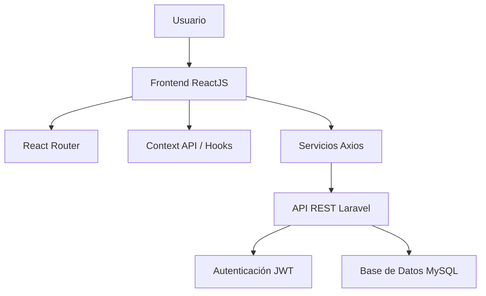
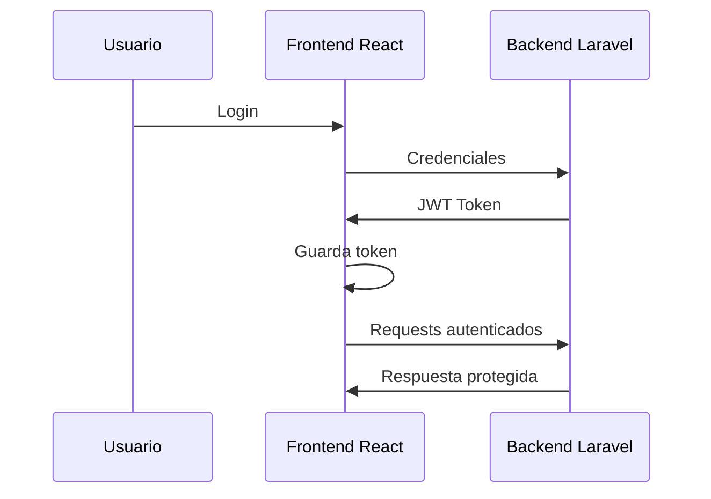

# FACTURIFY Front-End ReactJS

Aplicación Front-End del sistema FACTURIFY, desarrollada con ReactJS para la gestión integral de facturación, clientes, productos y procesos administrativos conectados a una API REST.

---

# 📌 Descripción General

FACTURIFY Front-End es una SPA (Single Page Application) desarrollada con tecnologías modernas de JavaScript enfocadas en:

- Gestión de autenticación de usuarios
- Administración de clientes
- Gestión de productos y servicios
- Facturación electrónica
- Consumo de APIs REST
- Manejo de sesiones con JWT
- Interfaces dinámicas y responsivas

El proyecto está diseñado bajo una arquitectura escalable y modular para facilitar mantenimiento, reutilización de componentes y crecimiento del sistema.

---

# 🚀 Tecnologías Utilizadas

| Tecnología | Descripción |
|---|---|
| ReactJS | Biblioteca principal para la interfaz |
| JavaScript / TypeScript | Lógica de negocio |
| React Router DOM | Manejo de rutas |
| Axios | Consumo de APIs |
| Context API / Hooks | Manejo de estado |
| TailwindCSS / CSS | Estilos visuales |
| JWT | Autenticación |
| Vite / CRA | Entorno de desarrollo |
| Git & GitHub | Control de versiones |

---

# 🏗️ Arquitectura del Proyecto



---

# 📂 Estructura del Proyecto

```bash
FACTURIFY-front-end-reactjs/
│
├── public/                 # Archivos públicos
├── src/
│   ├── assets/             # Recursos estáticos
│   ├── components/         # Componentes reutilizables
│   ├── pages/              # Vistas principales
│   ├── routes/             # Configuración de rutas
│   ├── services/           # Servicios Axios y APIs
│   ├── context/            # Context API
│   ├── hooks/              # Hooks personalizados
│   ├── layouts/            # Layouts del sistema
│   ├── utils/              # Funciones auxiliares
│   ├── styles/             # Estilos globales
│   ├── App.jsx             # Componente principal
│   └── main.jsx            # Punto de entrada
│
├── package.json
├── vite.config.js
├── .env
└── README.md
```

---

# ⚙️ Instalación del Proyecto

## 1️⃣ Clonar el repositorio

```bash
git clone https://github.com/IngLucioChavez/FACTURIFY-front-end-reactjs.git
```

---

## 2️⃣ Entrar al proyecto

```bash
cd FACTURIFY-front-end-reactjs
```

---

## 3️⃣ Instalar dependencias

```bash
npm install
```

o

```bash
yarn install
```

---

## 4️⃣ Configurar variables de entorno

Crear un archivo `.env`:

```env
VITE_API_URL=http://localhost:8000/api
```

---

## 5️⃣ Ejecutar el proyecto

```bash
npm run dev
```

---

# 🌐 Variables de Entorno

| Variable | Descripción |
|---|---|
| VITE_API_URL | URL del backend Laravel |

---

# 🔐 Autenticación JWT

El sistema utiliza JWT para el control de acceso y sesiones.

## Flujo de autenticación



---

# 🧩 Principales Módulos

## 📌 Dashboard

- Estadísticas generales
- Accesos rápidos
- Indicadores del sistema

---

## 👤 Usuarios

- Login
- Logout
- Manejo de sesiones
- Roles y permisos

---

# 🔄 Comunicación con Backend

El frontend consume una API REST desarrollada en Laravel.

## Ejemplo de consumo con Axios

```javascript
import axios from "axios";

const api = axios.create({
  baseURL: import.meta.env.VITE_API_URL,
});

export default api;
```

---

# 🛡️ Protección de Rutas

Ejemplo de rutas protegidas:

```javascript
<Route
  path="/dashboard"
  element={
    isAuthenticated
      ? <Dashboard />
      : <Navigate to="/login" />
  }
/>
```

---

# 🎨 Diseño UI/UX

El sistema implementa:

- Diseño responsivo
- Componentes reutilizables
- Navegación SPA
- Feedback visual
- Manejo de estados de carga
- Alertas y notificaciones


---

# 🧪 Scripts Disponibles

| Script | Descripción |
|---|---|
| npm run dev | Ejecuta entorno desarrollo |
| npm run build | Genera build producción |
| npm run preview | Vista previa producción |

---

# 🚀 Build para Producción

```bash
npm run build
```

Los archivos compilados se generan en:

```bash
dist/
```

---

# ☁️ Deploy

El proyecto puede desplegarse en:

- Vercel
- Netlify
- Firebase Hosting
- Railway
- Render

---

# 🐳 Docker (Opcional)

## Dockerfile básico

```dockerfile
FROM node:20

WORKDIR /app

COPY package*.json ./

RUN npm install

COPY . .

EXPOSE 5173

CMD ["npm", "run", "dev"]
```

---

# 📋 Buenas Prácticas Implementadas

- Componentización
- Separación de responsabilidades
- Hooks personalizados
- Manejo centralizado de APIs
- Variables de entorno
- Arquitectura escalable
- Reutilización de componentes

---

# 🔒 Seguridad

- Autenticación JWT
- Protección de rutas
- Manejo de sesiones
- Validaciones frontend
- Sanitización de datos

---

# 📚 Recomendaciones Técnicas

## Producción

- Implementar HTTPS
- Configurar variables seguras
- Manejo de refresh tokens
- Lazy loading
- Code splitting

---

# 🤝 Contribuciones

## Fork del proyecto

```bash
git fork
```

## Crear rama

```bash
git checkout -b feature/nueva-funcionalidad
```

## Commit

```bash
git commit -m "Nueva funcionalidad"
```

## Push

```bash
git push origin feature/nueva-funcionalidad
```

---

# 👨‍💻 Autor

Desarrollado por:

**Lucio Francisco Chávez García**

GitHub:

https://github.com/IngLucioChavez/FACTURIFY-front-end-reactjs

---

# 📄 Licencia

Proyecto de uso académico y profesional.

---

# 📌 Repositorio

https://github.com/IngLucioChavez/FACTURIFY-front-end-reactjs